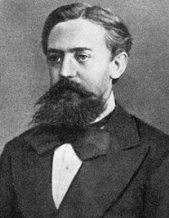

## 強化学習の応用例

[強化学習とは？手法やAIロボットなどの活用事例を紹介](https://aismiley.co.jp/ai_news/reinforcement-learning-mechanism-and-examples/)

## イントロの記事

[Deep Reinforcement Learning](https://www.kaggle.com/code/alexisbcook/deep-reinforcement-learning)

heuristic = 発見的手法

## MDPと強化学習の関係性

###### **マルコフ決定過程 (MDP)**

MDPは以下の4つの要素で構成されます：

1. **状態 (State, S)** : エージェントが存在する環境の状態。
2. **行動 (Action, A)** : エージェントが取ることができる行動。
3. **遷移確率 (Transition Probability, P)** : ある状態から次の状態への遷移の確率。
4. **報酬 (Reward, R)** : ある状態で特定の行動を取ったときに得られる報酬。

###### 強化学習 (RL)

強化学習では、エージェントは以下のプロセスを通じて学習します：

1. **観察** : エージェントは現在の状態を観察します。
2. **行動選択** : エージェントはポリシー（方策）に基づいて行動を選択します。
3. **報酬受け取り** : 行動の結果として報酬を受け取ります。
4. **状態遷移** : 行動の結果として次の状態に遷移します。
5. **更新** : 得られた報酬と次の状態に基づいてポリシーや価値関数を更新します。

###### 関係性

強化学習は、MDPのフレームワークを利用してエージェントが最適なポリシーを学習するプロセス。MDPの要素（状態、行動、遷移確率、報酬）を用いて、エージェントは試行錯誤を繰り返しながら最適な行動を見つけ出します。

MDP

> マルコフ決定過程（Markov Decision Process, MDP）は、意思決定の問題を数学的にモデル化するためのフレームワークです。MDPは、エージェントが環境と相互作用しながら最適な行動を選択するための基盤を提供します。MDPは以下の4つの要素で構成されます：
>
> 1. **状態 (State, S)** : エージェントが存在する環境の状態の集合。
> 2. **行動 (Action, A)** : エージェントが取ることができる行動の集合。
> 3. **遷移確率 (Transition Probability, P)** : ある状態から次の状態への遷移の確率。これは、状態と行動の組み合わせに依存します。
> 4. **報酬 (Reward, R)** : ある状態で特定の行動を取ったときに得られる報酬。
>
> MDPの目的は、エージェントが長期的な報酬を最大化するための最適なポリシー（方策）を見つけることです。ポリシーは、各状態でエージェントが取るべき行動を示すルールです。
>
> ※マルコフ過程は、直前の状態と行動のみが、次の状態と行動を生み出す。それより前の状態には影響を受けないというマルコフ性に基づくものとして理論展開されている

アンドレイ・マルコフ

> 
>
> * ロシアの数学者
> * 特に[確率過程](https://ja.wikipedia.org/wiki/%E7%A2%BA%E7%8E%87%E9%81%8E%E7%A8%8B "確率過程")論に関する業績で知られる。彼の研究成果は、後に[マルコフ連鎖](https://ja.wikipedia.org/wiki/%E3%83%9E%E3%83%AB%E3%82%B3%E3%83%95%E9%80%A3%E9%8E%96 "マルコフ連鎖")として知られるようになった。
> * 彼の息子（[1903年](https://ja.wikipedia.org/wiki/1903%E5%B9%B4 "1903年") - [1979年](https://ja.wikipedia.org/wiki/1979%E5%B9%B4 "1979年")）もまた著名な数学者であり、構成的数学や再帰関数論の発展に寄与した。

###### 建付け

1. 行動と状態を定義の上、遷移する確率(方策)を定義することで、行動様式の価値関数を最大化することで、次の行動が決まるというMDPが定義される
2. 行動価値関数を導出の上、具体的な解法を得るための手段としてベルマン方程式が導出される
3. いつも確率モデルが得られるわけではないため、モンテカルロ的な方策により最適行動に収束する強化学習のロジックにつながる

## A3C

A3C（Asynchronous Advantage Actor-Critic）は、深層強化学習の分野で用いられる高度なアルゴリズムの一つ

複数のエージェントが異なる環境で同時に学習を行い、その経験を共有することで効率的に学習を進める方法です。

### エージェントの役割

エージェントは、以下のような役割を持ちます：

* **観測：** 環境からの情報（状態）を受け取ります。
* **行動選択：** 与えられた状態に基づいて、どのような行動を取るかを決定します。
* **学習：** 行動の結果として得られる報酬（またはペナルティ）を用いて、より良い行動選択を学習します。

### 複数のエージェントの利点

複数のエージェントを用いることには、以下のような利点があります：

* **多様性：** 異なるエージェントが異なる環境や状況で学習することで、より多様な学習経験を得ることができます。
* **効率性：** 各エージェントが独立して学習を進めることで、全体としての学習プロセスが高速化されます。
* **堅牢性：** 一つのエージェントが失敗しても、他のエージェントが学習を続けることができるため、全体としての学習プロセスがより堅牢になります。
