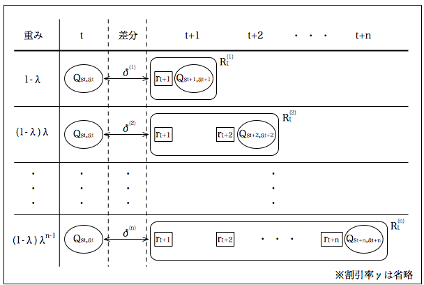
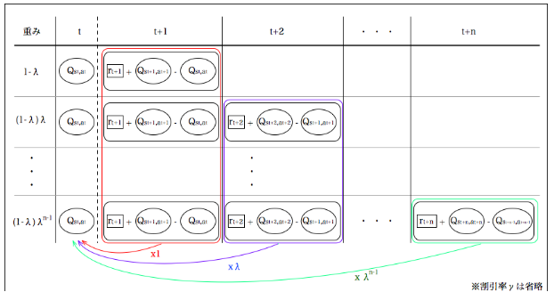
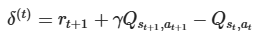
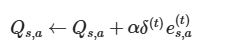
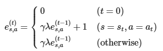

## TD(λ)法

TD(1)はTD誤差が1step先

TD(1)ではオンライン学習可能(データ収集必要ないため)だが、データのばらつきに引っ張られて、結果の安定性がない(下手したら、最適状態を誤ってしまう)

そこでnステップ先までの目標値を推定の上、nステップ分のデータにより学習を行う方法でばらつきを防止する。

例えば今**t**+**1**t+1にいるとすると、その価値の差分は**t**tで観測された状態行動対の価値に、各**n**nステップTD法で**1**−**λ**,**(**1**−**λ**)**λ**,**⋯**,**(**1**−**λ**)**λ**n**−**1**,**⋯1−λ,(1−λ)λ,⋯,(1−λ)λn−1,⋯の重みで影響を与えるのだから、合計で1倍の影響を与えることになる。

課題：

この方法をとった場合、**n**ステップ先にならないと現在の推定価値を更新できない

TD誤差δ(t)を以下のように定義する

Qを以下のように更新する

##### オンライン学習

> 逐次的に環境と相互作用してデータを収集しながら学習する。学習して行動変えながら環境にフィットさせるイメージ

##### バッチ学習

> オンライン学習と相対する学習法。大量のデータを環境から取得しておき、あとで学習する方法

## 適格度トレース

メカニズムはモンテカルロ法とTD法とを統合したもの

関数近似を取り入れた状態と行動間の関係の一般化（generalization）

最後に、動的計画法とヒューリスティック探索の長所を取り入れるために環境モデルの導入です。

適格度トレース（eligibility trace）は強化学習の基本的なメカニズムの1つです。TD法を適格度トレースによって補強すると、モンテカルロ法を一方の端、1ステップTD法を他方の端とした範囲にまたがる一連の手法が作り出されます。

時間ステップ**t**tにおいて、次の状態行動対**(**s**t**+**1**,**a**t**+**1**)**を観測したときに、その価値の差分をどれくらいの重みで各状態行動対**(**s**,**a**)の価値に反映させるのか、というもの。

1つ前の状態行動対の価値には、価値の差分の1倍、2つ前の状態行動対の価値には、価値の差分の**γ**λ倍、・・・の重みで、価値の差分の反映を行うことが出来るようになる。

###### 適格度を用いるメリット

1. 適格度トレースを使用することで、エージェントが過去の経験をより効果的に利用できるようになります。これにより、学習速度が向上
2. 適格度トレースは、エージェントが長期的な依存関係を考慮するのに役立ちます。これにより、エージェントは将来の報酬をより正確に予測できる
3. 適格度トレースを使用することで、エージェントの学習がより安定し、過去の状態と行動の影響を適切に評価できる
4. エージェントが環境の変化に迅速に適応するのを助ける

##### 定義

## Q学習+SARSAとモンテカルロ法

Q学習とSARSAは、1stepごとにQ関数を更新する

モンテカルロ法は、学習がワンセットおわるまで履歴を取得し、履歴からQ関数を更新する手法

この違いからオンライン学習とオフライン学習の差が生じる
