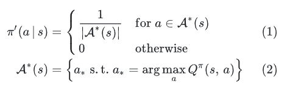

## ポリシー

Q学習に本格的に入るときに、ポリシーにのっとるか、のっとらないかで学習がオンポリシー/オフポリシーで明確に異なるとされる。

ではポリシーとはいかなるものか？

### ポリシーの種類

1. **決定的ポリシー（Deterministic Policy）** :

* 特定の状態に対して常に同じ行動を選択するポリシーです。
* 例: 状態 sにおいて、常に行動 a を選択する。

1. **確率的ポリシー（Stochastic Policy）** :

* 特定の状態に対して行動を確率的に選択するポリシーです。
* 例: 状態 s において、行動 a を選択する確率が π(a∣s)である。

### ポリシーの表現

ポリシーは、以下のように表現されます：

* π(s)\pi(s): 状態 ss における行動 aa を決定するポリシー。
* π(a∣s)\pi(a|s): 状態 ss における行動 aa を選択する確率を示すポリシー。

## モデルベース

モデルベースによる方策の最適化はプランニング＝動的計画法により価値を推定

推定する方法は"価値反復法"と"方策勾配法"

- 価値反復法 : 価値関数が[再帰](http://d.hatena.ne.jp/keyword/%BA%C6%B5%A2)的な形で定義できることを利用して，価値関数の値が収束するまで値を更新する（価値を反復して計算する）という手法。更新するのは価値関数。
- 方策反復法 : 価値関数が最大となるように方策を更新して求めます．方策を更新すると価値関数の値も変わるので，方策の更新（方策改善）と価値関数の算出（方策評価）を交互に行って方策算出する手法。更新するのは方策。

## モデルフリー

モデルフリーな状況では、状態遷移確率が未知であるため行動価値関数（以降、簡単のため Q 関数と呼ぶ）を直接的に推定しなければならない。

価値関数の推定法としてとりえるのは、モンテカルロ法、TD 学習を Q 関数の推定に適用することができる。

つまり・・・

モデルベースとは異なり，環境（遷移関数と報酬関数）が未知の場合は，エージェントと環境の相互作用により得られたデータを用いながら価値を推定

＝モデルを明らかに用いないで価値を推定し方策を学習する方法をモデルフリー

## Q関数の制御

環境モデルが既知の場合には、可能なすべての状態と行動の組み合わせについて Q 関数が計算できるので、Q 関数について greedy な方策

環境モデルが未知の場合、その時点までに観測された行動状態系列にしたがって Q 関数を推定するしかないので、Q 関数について greedy な方策が最適であるとは保証されない

## [モンテカルロ法](http://d.hatena.ne.jp/keyword/%A5%E2%A5%F3%A5%C6%A5%AB%A5%EB%A5%ED%CB%A1)

更新を1エピソードで行う手法を[モンテカルロ法](http://d.hatena.ne.jp/keyword/%A5%E2%A5%F3%A5%C6%A5%AB%A5%EB%A5%ED%CB%A1)といいます．更新式は次式です．

**V**π**(**s**t**)**←**V**π**(**s**t**)**+**α**(**G**t**−**V**π**(**s**t**)**)Vπ(st)←Vπ(st)+α(Gt−Vπ(st))

**G**tGt は割引報酬和です．実際に得られた即[時報](http://d.hatena.ne.jp/keyword/%BB%FE%CA%F3)酬を割り引いて足し合わせた値と推定価値の差を修正します．**α**α は[モンテカルロ法](http://d.hatena.ne.jp/keyword/%A5%E2%A5%F3%A5%C6%A5%AB%A5%EB%A5%ED%CB%A1)では状態**s**sに遷移した回数の逆数とし，平均値を出しています．

## TD学習とQ学習の違いとは？

#### TD学習

* **目的** : 状態価値関数 V(s)V(s) を学習すること。
* **手法** : 次の状態の価値を使って現在の状態の価値を更新します。具体的には、次のような更新式を使用します：

V(s)←V(s)+α[R+γV(s′)−V(s)]V(s) \leftarrow V(s) + \alpha \left[ R + \gamma V(s') - V(s) \right]

ここで、α\alpha は学習率、RR は報酬、γ\gamma は割引率、s′s' は次の状態です。

#### Q学習

* **目的** : 状態-行動価値関数 Q(s,a)Q(s, a) を学習すること。
* **手法** : 次の状態での最大のQ値を使って現在のQ値を更新します。具体的には、次のような更新式を使用します：

Q(s,a)←Q(s,a)+α[R+γmax⁡a′Q(s′,a′)−Q(s,a)]Q(s, a) \leftarrow Q(s, a) + \alpha \left[ R + \gamma \max_{a'} Q(s', a') - Q(s, a) \right]

ここで、a′a' は次の状態での行動です。

#### 違い

* **学習対象** :
* TD学習: 状態価値関数 V(s)V(s)
* Q学習: 状態-行動価値関数 Q(s,a)Q(s, a)
* **更新方法** :
* TD学習: 次の状態の価値 V(s′)V(s') を使って現在の状態の価値 V(s)V(s) を更新。
* Q学習: 次の状態での最大のQ値 max⁡a′Q(s′,a′)\max_{a'} Q(s', a') を使って現在のQ値 Q(s,a)Q(s, a) を更新。
* **適用範囲** :
* TD学習: 主に価値ベースの手法で使用されます。
* Q学習: 主に行動価値ベースの手法で使用されます。

### Q学習の特徴

1. **行動価値関数の学習** :

* Q学習は、状態 ss と行動 aa のペアに対する価値 Q(s,a)Q(s, a) を学習します。これにより、特定の行動がどれだけ有益かを評価できます。
* TD学習は主に状態価値関数 V(s)V(s) を学習するため、行動の選択に直接的な影響を与えることが難しい場合があります。

1. **オフポリシー学習** :

* Q学習はオフポリシー学習アルゴリズムであり、現在のポリシーとは異なるポリシーに基づいて行動を選択しながら学習できます。これにより、探索と利用のバランスを取りやすくなります。
* TD学習はオンポリシー学習アルゴリズムであり、現在のポリシーに基づいて行動を選択しながら学習します。

1. **最適ポリシーの導出** :

* Q学習は、最適な行動価値関数 Q∗(s,a)Q^*(s, a) を学習することで、最適ポリシーを導出できます。これにより、最適な行動を選択することが可能です。
* TD学習は、価値関数 V(s)V(s) を学習するため、最適ポリシーの導出には追加の手順が必要です。

#### Q学習が向いているケース

* **複雑な行動選択** : 状態空間が大きく、行動の選択が複雑な場合、Q学習は行動価値関数を直接学習するため、より効果的です。
* **探索と利用のバランス** : オフポリシー学習により、探索と利用のバランスを取りやすく、未知の環境での学習が効果的です。
* **最適ポリシーの導出** : 最適ポリシーを直接導出できるため、最適な行動を選択する必要がある場合に有効です。

### これまでの経緯おさらい

1.MDPによる行動価値関数、方策、価値関数を基にした最適化問題

表現しきれないケースが生じてきた

2.TD誤差を導入して、オフライン学習可能なモデルを導入

モデルフリーの問題で行動最適化を実現する。そのためには未知の状況から行動価値関数を最適化できる理屈が必要だった

3.方策ベース手法の導入

2のスコープは価値ベースの手法となっていた。これは方策が目に見えないものだったから。

方策をパラメータで表現できるようにし、方策勾配による最適化を実現するようにして方策ベース手法が使えるようになる

## 総括

- MDPが分かっている状態であればベルマン方程式の解を、手元の情報のみから算出可能
- MDPが分からない場合は探索的な手法をとることになる。この時もオンポリシー、オフポリシーの２パターンある
- オンポリシーはSARSA、オフポリシーはQ学習
