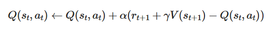
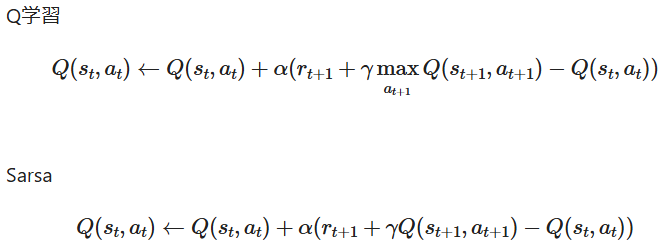
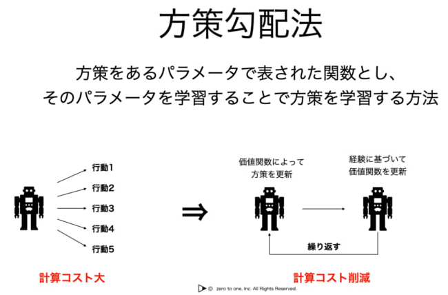
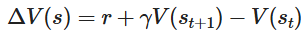
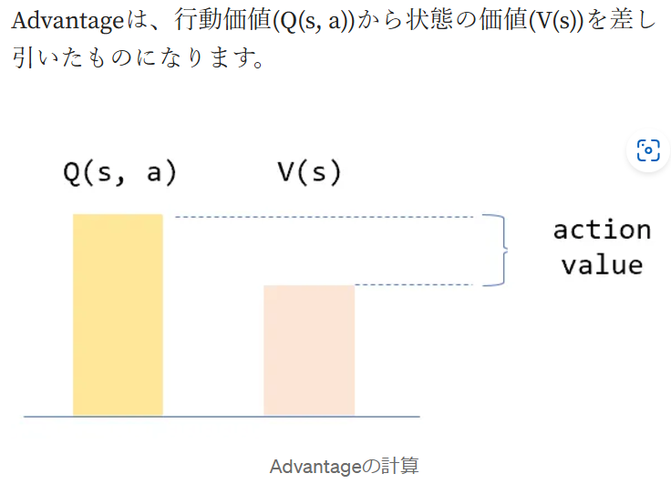
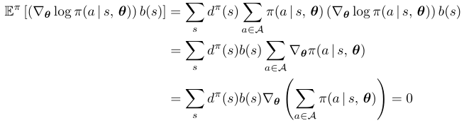
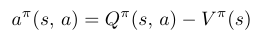

## 背景

方策勾配はQ関数による重み付け平均として定義

Q関数による方策評価が方策の学習に取り込まれていた。

状態行動空間が、状態数と自由度ともに小さいならばモデル化の必要なし。

方策ベース手法が高次元かつ連続な行動空間に対してい派、Q関数もモデル化=パラメータ化が必要となる。

エージェントが担う方策評価と方策評価の機能を分離して、個々にモデル化する手法が有効となる。

## Actor Critic法

Actor Critic法はValueベースとPolicyベースを組み合わせた手法

[Sarsa、Actor-Critic法の解説および倒立振子問題を解く #Python - Qiita](https://qiita.com/KokiSakano/items/0ab412ae9f69865f26d2)

Sarsaでは行動決定と状態更新は同一のQテーブルで行われていた

Actor Critic法では行動決定Actorと状態更新Criticを異なるテーブルで行い、これらを相互に更新し学習

更新式は以下。更新する場合のベースが価値関数であることが注意。



因みにQ学習とSarsaの更新式とも比較を行う。



Q学習では状態st+1における最大の価値を採用。

Sarsaでは次の行動at+1を決めて、価値Q(st+1, at+1)を採用

#### 前回までの確認

Q学習では次の行動をQ値の更新後に決定し、Sarsaでは次の行動をQ値の更新前に決定

Q学習は価値が最大となるような行動で状態更新する(Valueベース)ことから方策オフ型のアルゴリズム

Sarsaは戦略に基づいた行動で状態更新する(Policy)ことから方策オン型のアルゴリズム

実装での差分は以下

SARSAでは、次の行動 `next_action` を選択してからQ値を更新、Q学習では次の状態での最大のQ値を使用してQ値を更新。

Sarsa

```
class Env():
    def __init__(self, env, sarsa_class):
        self.env = env
        self.sarsa_class = sarsa_class

    def run(self):
        # 状態数を取得
        num_states = self.env.observation_space.shape[0]
        # 行動数を取得
        num_actions = self.env.action_space.n
        sarsa = self.sarsa_class(num_states, num_actions)

        step_list = []
        mean_list = []
        std_list = []
        for episode in range(NUM_EPISODES):
            observation = self.env.reset()  # 環境の初期化
            frames = []
            # 初期行動を求める
            action = sarsa.decide_action(observation, 0)
            for step in range(MAX_STEPS):
                if episode == NUM_EPISODES-1: frames.append(self.env.render(mode='rgb_array'))
                # 行動a_tの実行により、s_{t+1}, r_{t+1}を求める
                observation_next, _, done, _ = self.env.step(action)
                # 初期行動を求める
                action_next = sarsa.decide_action(observation_next, episode+1)
                # 報酬を与える
                if done:  # ステップ数が200経過するか、一定角度以上傾くとdoneはtrueになる
                    if step < 195:
                        reward = -1  # 失敗したので-1の報酬を与える
                    else:
                        reward = 1  # 成功したので+1の報酬を与える
                else:
                    reward = 0
                # Qテーブル, Vを更新する
                sarsa.update_Qtable(observation, action, reward, observation_next, action_next)
                # 観測値を更新する
                observation = observation_next
                # 行動を更新する
                action = action_next

                # 終了時の処理
                if done:
                    step_list.append(step+1)
                    print('{}回目の試行は{}秒持ちました。(max:200秒)'.format(episode, step + 1))
                    break

            if episode == NUM_EPISODES-1:
                plt.figure()
                patch = plt.imshow(frames[0])
                plt.axis('off')

                def animate(i):
                    patch.set_data(frames[i])

                anim = animation.FuncAnimation(plt.gcf(), animate, frames=len(frames), interval=50)
                anim.save('movie_cartpole_v0_{}.gif'.format(episode+1), "ffmpeg")

        es = np.arange(0, len(step_list))
        plt.clf()
        plt.plot(es, step_list)
        plt.savefig("reward.png")
        for i, s in enumerate(step_list):
            if i < 100:
                mean_list.append(np.average(step_list[:i+1]))
                std_list.append(np.std(step_list[:i+1]))
            else:
                mean_list.append(np.average(step_list[i-100:i+1]))
                std_list.append(np.std(step_list[i-100:i+1]))
        mean_list = np.array(mean_list)
        std_list = np.array(std_list)
        plt.clf()
        plt.plot(es, mean_list)
        plt.fill_between(es, mean_list-std_list, mean_list+std_list, alpha=0.2)
        plt.savefig("mean_var.png")

if __name__ == "__main__":
    env = gym.make("CartPole-v0")
    env = Env(env, Sarsa)
    env.run()


```

Q学習

```
import gym
import numpy as np

# 環境の初期化
env = gym.make('CartPole-v1')

# Qテーブルの初期化
state_space = [20, 20, 20, 20]  # 状態空間の分割数
q_table = np.random.uniform(low=-1, high=1, size=(state_space + [env.action_space.n]))

# ハイパーパラメータの設定
alpha = 0.1  # 学習率
gamma = 0.99  # 割引率
epsilon = 1.0  # 探索率
epsilon_decay = 0.995  # 探索率の減衰
min_epsilon = 0.01  # 最小探索率
episodes = 10000  # エピソード数

# 状態を離散化する関数
def discretize_state(state):
    state_adj = (state - env.observation_space.low) * np.array(state_space) / (env.observation_space.high - env.observation_space.low)
    return tuple(state_adj.astype(int))

# Q学習のメインループ
for episode in range(episodes):
    state = discretize_state(env.reset())
    done = False
    total_reward = 0

    while not done:
        if np.random.uniform(0, 1) < epsilon:
            action = env.action_space.sample()  # 探索
        else:
            action = np.argmax(q_table[state])  # 利用

        next_state, reward, done, _ = env.step(action)
        next_state = discretize_state(next_state)

        # Q値の更新
        q_value_current = q_table[state + (action,)]
        q_value_max = np.max(q_table[next_state])
        q_table[state + (action,)] = q_value_current + alpha * (reward + gamma * q_value_max - q_value_current)

        state = next_state
        total_reward += reward

    # 探索率の減衰
    epsilon = max(min_epsilon, epsilon * epsilon_decay)

    if episode % 100 == 0:
        print(f"Episode: {episode}, Total Reward: {total_reward}, Epsilon: {epsilon}")

env.close()

```

## 方策勾配法

方策は行動価値関数から導出されるものとして定義

エージェントは行動価値関数を試行錯誤を通して学習することで、最適な方策を求めた

方策を価値関数とは別のパラメータで表現し、最適化することで強化学習問題を解く方法も考えられる。

方策勾配に基づくアルゴリズムでは、Q-learningやSarsaなと行動価値関数を更新していくアルゴリズムと異なり、方策𝜋を明示的に更新

#### 学習の流れ

1. 方策𝜋𝜃(𝑎|𝑠)による行動
2. 方策𝜋𝜃(𝑎|𝑠)の評価
3. 方策𝜋𝜃(𝑎|𝑠)の更新

[【強化学習】方策勾配法の仕組みと学習のワークフロー - ころがる狸](https://dajiro.com/entry/2020/05/19/170402#%E6%96%B9%E7%AD%96%E5%8B%BE%E9%85%8D%E6%B3%95%E3%81%AE%E4%BB%95%E7%B5%84%E3%81%BF)

方策勾配法は、 **エージェントの行動確率をニューラルネットワークで表現するためのテクニックです** 。

状態**s**sを入力として**a**a = (0.2, 0.5, 0.1, 0.2)のように行動を確率で出力してくれる関数をイメージして下さい（ここでは行動が離散的に表現できることを前提にします）。これ自体がニューラルネットワークなので、パラメータ**θ**θは確率的勾配降下法によって以下のように更新できます。

**θ**t**+**1**=**θ**t**+**α**∇**J**(**θ**)

さて、パラメータ更新をする際にはこの微分値が必要なわけですが、これは以下のように表されることが**方策勾配定理**によって知られています。

**∇**J**(**θ**)**∝**∑**s**∈**S**μ**(**s**)**∑**a**∈**A**∇**π**θ**(**a**|**s**)**Q**π**θ**(**s**,**a**)

最適な方策を見出すのは難しいため、Q学習では価値関数を最適化していくという考え方

直接最適な方策を見つけ出すアプローチが方策勾配法

方策をパラメータで表された関数とし、パラメータを学習することで方策を学習する方法



## アドバンテージ関数

TD学習（時間的差分学習: Temporal Difference Learning）とは、代表的な価値ベース手法一つ

[深層強化学習（A2C）を用いたシステムトレーディング #Python - Qiita](https://qiita.com/sugiyama404/items/d2224292a9da40cc4939)

TD = MC(モンテカルロ方策) + DP(Dynamic Programming: 動的計画法)
MC: 経験から学習
DP: 直後の状態の価値から学習



A2C(Advantage Actor-Critic)とは、A3C(Asynchronous Advantage Actor-Critic)から、非同期の部分を抜いたもの



[AdvantageでActor-Criticを学習する際の注意点. Advantageを使ったActor-Criticの学習で、ちょっとはまった点が… | by piqcy | programming-soda | Medium](https://medium.com/programming-soda/advantage%E3%81%A7actor-critic%E3%82%92%E5%AD%A6%E7%BF%92%E3%81%99%E3%82%8B%E9%9A%9B%E3%81%AE%E6%B3%A8%E6%84%8F%E7%82%B9-a1b3925bc3e6)

> Q関数のバリアンスが大きくなる原因は、Q関数が状態変数と行動変数の両方に依存するため変数ごとのバリアンスが重なってQ関数のバリアンスを大きくしていることによる。
>
> 
>
> ベースライン関数として価値関数π( )を選んだとき、Q関数を価値関数でシフトした関数のこと
> をアドバンテージ関数（advantage function）と呼ぶ。
>
> 
