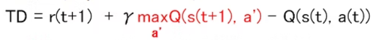
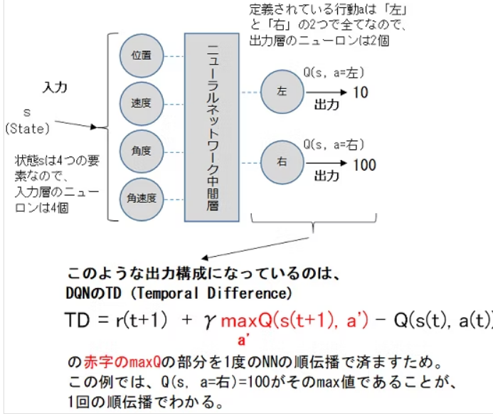
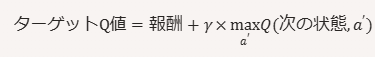
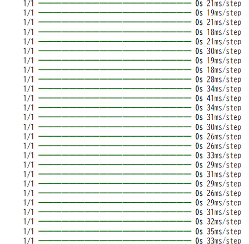
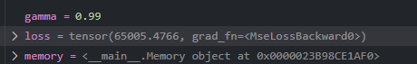
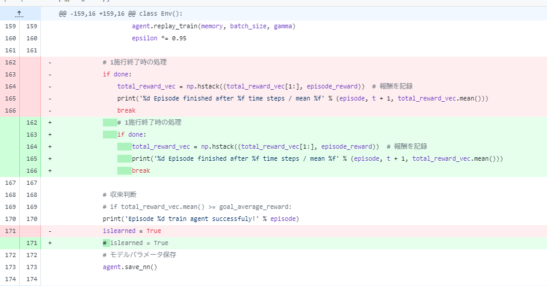

## DQN

Q学習までは、行動価値関数を表で表現していた。

→表のサイズは状態sを離散化した数×行動の種類で表現

表ではサイズに限りがあるため、ニューラルネットワークを使用したかったのですが、うまくいっていなかった

Q関数の表現にDeep Learningを使用したのがDQN(Deep Q-Network もしくは Deep Q-Learning Network)

DQNの出現により、より複雑なゲームや制御問題の解決が可能になり、強化学習が注目を集めました。

## 違いは？

行動価値（Q）関数が表形式からニューラルネットワークに変化したこと

Q関数の更新式自体は従来方法と変化はない





## 経験再生

Q関数のパラメータを更新するに利用する経験に、Q関数の行動の影響が出てくる→経験に偏りが生じる

→Q関数の影響をなくすために、エージェントによる観測された状態、行動、報酬を蓄積してhistory化。
→経験と呼ぶ

経験を再利用することで、一度経験を何度も利用できるし、エージェントの経験を除外した学習に利用することができる
(自動的に、方策オフ学習していることになる)

所感：オンライン学習している場合、とってくる情報には、エージェントの行動影響が出てくる→影響を除外するためには経験再生を行うことが基本となる

## 方策のモデル化とDQN

状態→行動を行うものが方策。方策のモデル化は、エージェントが特定の状態でどの行動を取るべきかを直接学習する方法。

方策ベースの方法では、方策（policy）π(a∣s)は、状態sに対して行動aを選択する確率

方策の学習法

* **REINFORCE** : モンテカルロ法を使用して方策を更新する方法。
* **Actor-Critic** : 方策（Actor）と価値関数（Critic）を同時に学習する方法。

DQNは価値ベースが基本の考え。状態→行動を示すという意味では方策ベースの考え方と同じ。

Q学習をディープニューラルネットワークで拡張したもの

DQNは、状態-行動ペアのQ値を学習し、最適な行動を選択

特徴は以下

* **Q値の近似** : ニューラルネットワークを使用してQ値を近似します。
* **経験再生** : 過去の経験をメモリに保存し、ランダムにサンプリングして学習します。
* **(DDQNのみ)ターゲットネットワーク** : 学習の安定性を向上させるために、ターゲットネットワークを使用します。

## 報酬のクリッピング

即時報酬を、+1、0，-1の3通り「のみ」とする。
これにより、訓練は安定しスピードが向上するとされる。
一般的には、（本来の即時報酬値が）正の場合は+1，負の場合は-1，0の場合はそのまま0。

## 実装練習

pole問題にDQNを実装してトライアルする。

##### Agent

* kerasでNNを構築。
* NNに基づいて行動判断(行動価値関数＋方策関数)

##### Memory

* 状態、行動、報酬、次の状態の情報を履歴化する
* 学習時はランダムにバッチサイズ分取得する

各経験（状態、行動、報酬、次の状態、終了フラグ）に対して以下の処理を行います：

* `target` を報酬で初期化します。
* エピソードが終了していない場合、次の状態での最大Q値を割引率 `gamma` を掛けて報酬に加算します。
* 現在の状態に対するQ値を予測し、行動に対応するQ値を `target` に更新します。
* 更新されたQ値を使用してモデルを1エポック学習します。

経験再生の中の学習のうち、ロスにされているのは、ターゲットQ値とエージェントによる予測Q値(基本予測Q値がモデルの出力)。

エージェントが予測Q値とターゲットQ値の差を最小化するように学習することとなり、ターゲットQ値に近づくように学習が進む。

ターゲットQ値は、現在の報酬と次の状態で得られる最大のQ値を組み合わせて計算されます。これにより、将来の報酬を考慮に入れた価値が反映されます。



```
ターゲットQ値は、エージェントが将来の報酬を最大化するために現在の状態で取るべき最適な行動の価値を表します。
```

コード

```

def replay(self, memory, batch_size, gamma, targetQN):
        inputs = np.zeros((batch_size, 4))
        targets = np.zeros((batch_size, 2))
        # バッチサイズ分の経験を取得
        mini_batch = memory.sample(batch_size)
        # 学習サイクル
        # 状態、アクション、報酬、次の状態の取得
        for i, (state_b, action_b, reward_b, next_state_b) in enumerate(mini_batch):
            inputs[i:i + 1] = state_b
            target = reward_b
 
            if not (next_state_b == np.zeros(state_b.shape)).all(axis=1):
                # 価値計算（DDQNにも対応できるように、行動決定のQネットワークと価値観数のQネットワークは分離）
                ret_model = self.model.predict(next_state_b)[0]
                next_action = np.argmax(ret_model)  # 最大の報酬を返す行動を選択する
                target = reward_b + gamma * self.model.predict(next_state_b)[0][next_action]
  
            targets[i] = self.model.predict(state_b)    # Qネットワークの出力
            targets[i][action_b] = target               # 教師信号

        # shiglayさんよりアドバイスいただき、for文の外へ修正しました
        self.model.fit(inputs, targets, epochs=1, verbose=0)
```

pytorchの場合

lossは期待報酬により算出

```
# 経験再生による学習
def replay():
    global epsilon
    if len(memory) < batch_size:
        return
    minibatch = random.sample(memory, batch_size)
    for state, action, reward, next_state, done in minibatch:
        state = torch.FloatTensor(state).unsqueeze(0)
        next_state = torch.FloatTensor(next_state).unsqueeze(0)
        target = reward
        if not done:
            target = reward + gamma * torch.max(target_model(next_state)).item()
        target_f = model(state)
        target_f[0][action] = target
        optimizer.zero_grad()
        loss = criterion(target_f, model(state))
        loss.backward()
        optimizer.step()
    if epsilon > epsilon_min:
        epsilon *= epsilon_decay
```

### 具体例

例えば、以下のような状況を考えます：

* 現在の状態 `state` に対するQ値が `[1.0, 2.0, 3.0]` であるとします。
* 行動 `action` が `1` であるとします。
* 計算された目標Q値 `target` が `5.0` であるとします。

この場合、`target_f` は `[1.0, 2.0, 3.0]` となり、`target_f[0][1]` は `2.0` です。この行を実行すると、`target_f` は `[1.0, 5.0, 3.0]` に更新されます。



## gymの出力

* **状態（state）** :

環境の現在の状態を表します。これは、エージェントが次の行動を決定するために使用する情報です。例えば、CartPole環境では、状態はカートの位置、速度、ポールの角度、角速度などの値を含みます。

* **報酬（reward）** :

エージェントが取った行動に対して与えられる即時の報酬です。報酬は、エージェントが目標を達成するための指標となります。例えば、CartPole環境では、ポールが倒れずに立っている時間に応じて報酬が与えられます。

```
ポールが倒れなかった場合:

エージェントがポールを倒さずに立て続けた場合、各タイムステップごとに報酬として+1が与えられます。

例えば、エージェントが10ステップの間ポールを倒さずに立て続けた場合、合計報酬は10になります。

ポールが倒れた場合:

ポールが一定の角度を超えて倒れた場合、エピソードが終了し、報酬として-10が与えられます。

例えば、エージェントが15ステップ目でポールを倒した場合、合計報酬は15 - 10 = 5になります。
```

* **終了フラグ（done）** :

エピソードが終了したかどうかを示すブール値です。`<span>True</span>`の場合、エピソードが終了し、エージェントは新しいエピソードを開始する必要があります。例えば、CartPole環境では、ポールが一定の角度を超えて倒れた場合や、カートがトラックの端に到達した場合にエピソードが終了します。

* **追加情報（info）** :

環境に関する追加の診断情報を含む辞書です。この情報は、学習には直接関係しないが、デバッグや分析に役立つ場合があります。

```
State: [ 0.01624345  0.01956772 -0.0318174  -0.03100419]
Next State: [ 0.0166348   0.21475963 -0.03243748 -0.31933355]
Reward: 1.0
Done: False
Info: {}

```

## エラー

学習がうまくいっていない。

この時にロスが異常に大きい値となっていた。→おそらく処理に間違いがあるから



結果：うまくいくようになった

変えた場所は以下

doneでエピソードは終了

学習終えるモードをなくす

→学習用データが収集できてなかったことから上手くいっていなかった



ということで学習のエッセンスはtorchのdqnにある

- メモリはアレイに蓄積後、適当に取り出し学習に回す
- 学習は以下の価値関数target = reward + gamma * torch.max(next_q_values).item()に基づく
- Qvalu計算(計算には次の状態を使う)→モデルで計算したQ値に、今回行動分のQvalを更新→これが(あるべき)教師データとして、実際のモデルの計算とロスをとる
- 意味合いとしては、与えられたQ関数のもとの最適な行動は次時点のQvalの最大値を選択することにある。これを表現してるということ

> Q学習の目的は、エージェントが最適な行動方針（ポリシー）を学習し、長期的な報酬を最大化することです。次の状態で得られる最大のQ値を考慮することで、エージェントは将来の報酬を見越して行動を選択するようになります。
