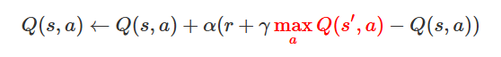
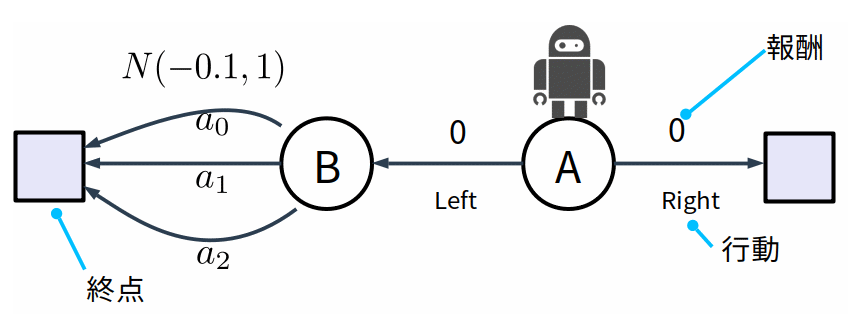
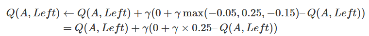
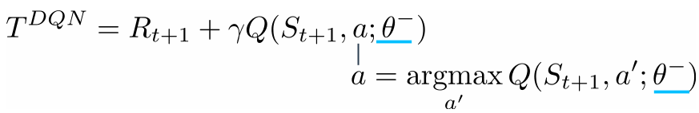
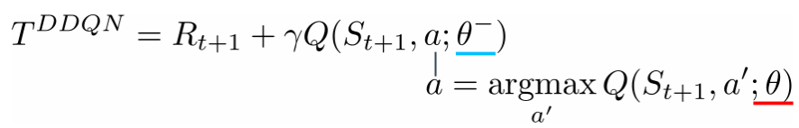
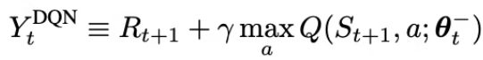
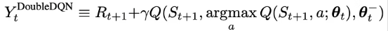
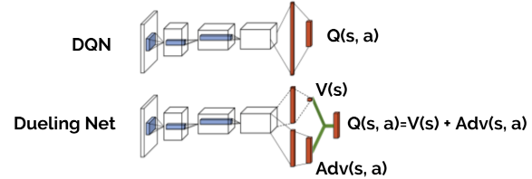
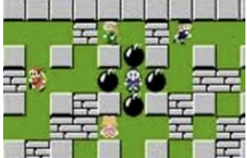

## 背景

Q学習の課題

Q学習は遷移先の最大行動価値を用いているので、過大評価(overestimate)という問題

Q学習の更新式



過大評価の原因：赤の部分がQ学習の特徴である**最大行動価値**を利用している箇所

**たまたまある状態で高い報酬を得てしまった場合、
そこの状態を良い状態と判断してしまい、その結果がその他の状態価値にまで伝搬してしまいます。**

具体例

状態Aがスタート地点、四角がゴール地点(終点)



状態Bから左への選択肢は複数、報酬の期待値は**N**(**−**0.1**,**1**)**

状態Aからエージェントは右、左のどちらが良いかを学習

←を選択した場合の報酬期待値：(**0**−**0.1**γ**)**=**−**0.1**γ**

→本当はエージェントは状態Aでは右を選んだほうが良い

報酬テーブル

| **a**0 | **a**1 | **a**2 |
| ------------ | ------------ | ------------ |
| -1           | 1            | -0.1         |
| 0.9          | -0.5         | -0.2         |



**−**0.05**=**(**−**1**+**0.9**)**/**2**、**0.25**=**(**1**−**0.5**)**/**2**, **−**0.15**=**(**−**0.1**−**0.2**)**/**2**

この状況では**Q**(**A**,**L**e**f**t**)**>**0→左のほうが良い**

## Double Deep Q Network

**2つのQ Network** (Q Network, Target Network)を用いて、過大評価を軽減

通常のDQNのTDターゲット**T**D**Q**Nを確認



θ**−**はTarget Networkのパラメータ

**θ**はQ Networkのパラメータ



単純にTarget Networkの遷移先状態**S**t**+**1の最大行動価値**max**a**Q**(**S**t**+**1**,**a**;**θ**−**)を用いるのではなく、
Q Networkの**S**t**+**1における行動価値を最大化する行動**a**=**argmax**a**Q**(**S**t**+**1**,**a**;**θ**)**を用いてTD ターゲットの値を決める

Target Networkの最大行動価値を用いるのではなく、Q Networkを組み合わせることでQ学習の特徴（最大行動価値を使う）を維持しながら、過剰評価を軽減

## 更新式の比較

学習を安定させるための工夫として **Fixed Target Q-Network**

DQN



double DQN



> その低減策として行動決定をQ-networkによって行い、Q(s, a)の評価はtarget-Q-network によって行うDouble-Q-learingの適用を提案しました。

**Dueling-network[アーキテクチャ](http://d.hatena.ne.jp/keyword/%A5%A2%A1%BC%A5%AD%A5%C6%A5%AF%A5%C1%A5%E3)ではQネットワークが出力する"状態価値 V(s)" と "アドバンテージ A(s, a)" の和をとったものをQ(s, a)**



#### アドバンテージとは?

アドバンテージA(s, a)とは状態行動価値Q(s, a)から状態価値V(s)を引いた値

**Q**(**s**,**a**)**=**V**(**s**)**+**A**(**s**,**a**)Q(s,a)=V(s)+A(s,a)

状態価値V(s)とアドバンテージA(s, a)を分けて学習する[アーキテクチャ](http://d.hatena.ne.jp/keyword/%A5%A2%A1%BC%A5%AD%A5%C6%A5%AF%A5%C1%A5%E3)は、どのような行動をとっても価値がほとんど変わらないような状態において学習を促進する

##### メリット

どんな行動をとっても結果が変わらないことは明らかであるので、Q(s, a) ≒ V(s)

V(s)は行動選択に依存しない価値であるのでDueling-network[アーキテクチャ](http://d.hatena.ne.jp/keyword/%A5%A2%A1%BC%A5%AD%A5%C6%A5%AF%A5%C1%A5%E3)ではどのアクションaを選択してもQ(s, a)の近似性能が大きく改善

Q(s, a)を直接出力する[DQN](http://d.hatena.ne.jp/keyword/DQN)[アーキテクチャ](http://d.hatena.ne.jp/keyword/%A5%A2%A1%BC%A5%AD%A5%C6%A5%AF%A5%C1%A5%E3)ではこのような明らかに絶望的な状態sでもすべての行動aを試さなければよい近似性能が得られない



Dueling Networkは、Q値を状態価値関数 V(s)V(s) とアドバンテージ関数 A(s,a) に分けて学習する手法

アドバンテージ関数 A(s,a) は、特定の行動 aa が他の行動と比べてどれだけ良いかを示す値

具体的には、状態 s における行動 aの相対的な価値を表します。これに対して、状態価値関数 V(s) は、状態 s にいること自体の価値

実装コード

```}
import tensorflow as tf
import tensorflow.keras.layers as kl


class DuelingQNetwork(tf.keras.Model, SamplingMixin):

    def __init__(self, actions_space):

        super(DuelingQNetwork, self).__init__()
        self.action_space = actions_space
        self.conv1 = kl.Conv2D(32, 8, strides=4, activation="relu",
                               kernel_initializer="he_normal")
        self.conv2 = kl.Conv2D(64, 4, strides=2, activation="relu",
                               kernel_initializer="he_normal")
        self.conv3 = kl.Conv2D(64, 3, strides=1, activation="relu",
                               kernel_initializer="he_normal")
        self.flatten1 = kl.Flatten()
        self.dense1 = kl.Dense(512, activation="relu",
                               kernel_initializer="he_normal")
        self.value = kl.Dense(1, kernel_initializer="he_normal")
        self.dense2 = kl.Dense(512, activation="relu",
                               kernel_initializer="he_normal")
        self.advantages = kl.Dense(self.action_space,
                                   kernel_initializer="he_normal")
    
    @tf.function
    def call(self, x):

        x = self.conv1(x)
        x = self.conv2(x)
        x = self.conv3(x)
        x = self.flatten1(x)

        x1 = self.dense1(x)
        value = self.value(x1)

        x2 = self.dense2(x)
        advantages = self.advantages(x2)
        advantages_scaled = advantages - tf.reduce_mean(advantages, axis=1, keepdims=True)
    
        q = value + advantages_scaled

        return q
```


### DDQNアルゴリズム

1. 2つの独立したQ関数、Q1とQ2を初期化する。
2. エージェントは状態sで行動aを選択する。
3. 環境から次の状態s’と報酬rを観測する。
4. Q1とQ2のうちの1つをランダムに選択して、次の状態s’での最大Q値を求める。例えば、Q1を選択した場合、Q2(s’, argmax(Q1(s’, a’)))を計算する。
5. Q1とQ2の平均値を使って、現在の状態sでのQ値を更新する。具体的には、Q1(s, a) = Q1(s, a) + α * (r + γ * Q2(s’, argmax(Q1(s’, a’))) – Q1(s, a))とする。
6. 学習を繰り返し、Q1とQ2を交互に更新する。

Qを入れ替えて、たまたまを平準化するというような意味っぽい。
