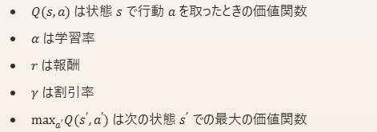

## 目的

オフポリシーの学習が可能なQ学習の練習台としてgymより提供されているpole問題を解いてみる。

##### 参考

[Pythonで始める強化学習！無料で試せる方法から具体的な実装例まで解説 | AI研究所](https://ai-kenkyujo.com/programming/language/python/python-3/)

[第3回 今更だけど基礎から強化学習を勉強する 価値推定編(TD法、モンテカルロ法、GAE) #Python - Qiita](https://qiita.com/pocokhc/items/312c817f9ddb0c5615da)

## 使う環境のスペック

[CartPole v0 · openai/gym Wiki](https://github.com/openai/gym/wiki/CartPole-v0)

| Num | Observation          | Min                  | Max                |
| --- | -------------------- | -------------------- | ------------------ |
| 0   | Cart Position        | -2.4                 | 2.4                |
| 1   | Cart Velocity        | -Inf                 | Inf                |
| 2   | Pole Angle           | ~ -0.418 rad (-24°) | ~ 0.418 rad (24°) |
| 3   | Pole Velocity At Tip | -Inf                 | Inf                |

各種観察値を元に状態を数値で表します。
イメージとしては、

* 1の位が「cart_position」
* 10の位が「cart_velocity」
* 100の位が「pole_angle」
* 1000の位が「pole_velocity」

という風に桁で分けているイメージです。

## Action

| Num | Action                 |
| --- | ---------------------- |
| 0   | Push cart to the left  |
| 1   | Push cart to the right |

## この問題における学習

- poleより観測される状態と報酬より、行動価値関数を算出が可能
- ポリシーより外れる行動も可としているため、オフポリシー
- 行動価値関数は以下式よりあらわされる=一番良いとされる行動にそって行動した場合の報酬と、これまでの行動価値との差分を学習対象とする(考え方はTD誤差と類似っす)

以下理由よりオフポリシー学習となる

* **Q学習（Q-Learning）** : 上記の数式はQ学習の更新ルールを表しています。Q学習は典型的なオフポリシーアルゴリズムです。
* **行動選択と学習の分離** : オフポリシー学習では、エージェントが現在のポリシーとは異なるポリシーに基づいて行動を選択しながら学習します。具体的には、Q学習では次の状態での最大のQ値（max⁡a′Q(s′,a′)\max_{a'} Q(s', a')）を使用して現在のQ値を更新します。これは、**エージェントが実際に取った行動とは異なる行動に基づいて学習**することを意味します。

## 結論

Q学習により、pole問題を解くことが出来ることが確認できた。

この問題上では、poleを動かすエージェントは状態における、ベストな行動価値関数に従って行動を行う。

## Double DQNの実装の方法

[https://arxiv.org/pdf/1509.06461.pdf](https://arxiv.org/pdf/1509.06461.pdf)

DQNの問題(結構何度も言ってる)

TD誤差の更新時にQ関数の最大値を使うことから、課題評価する可能性がある

→TD誤差の安定化のため、２つのQ関数を織り交ぜる

最適行動をDQNで求めた後、更新式で別のDQNで算出する流れ

ほとんど流用で作れる。

環境：そのまま利用

ネットワーク：

行動用と、更新用の２つ。どちらもベースは同じネットワークを使っている。

経験メモリ：そのまま利用

注意点：リワードは取得→可視化すること
